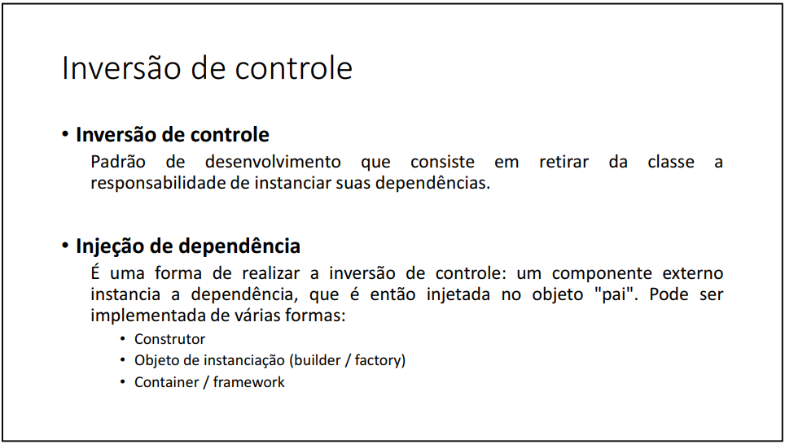

# Interface

 

## Inversão de controle, Injeção de dependência

 

## Exercício:

Uma empresa deseja automatizar o processamento de seus contratos. O processamento de
um contrato consiste em gerar as parcelas a serem pagas para aquele contrato, com base no
número de meses desejado.

A empresa utiliza um serviço de pagamento online para realizar o pagamento das parcelas.
Os serviços de pagamento online tipicamente cobram um juro mensal, bem como uma taxa
por pagamento. Por enquanto, o serviço contratado pela empresa é o do Paypal, que aplica
juros simples de 1% a cada parcela, mais uma taxa de pagamento de 2%.

Fazer um programa para ler os dados de um contrato (número do contrato, data do contrato,
e valor total do contrato). Em seguida, o programa deve ler o número de meses para
parcelamento do contrato, e daí gerar os registros de parcelas a serem pagas (data e valor),
sendo a primeira parcela a ser paga um mês após a data do contrato, a segunda parcela dois
meses após o contrato e assim por diante. Mostrar os dados das parcelas na tela.

Exemplo:

 

## Herdar *vs* Cumprir contrato

 

## Herança múltipla e o problema do diamante  

 

## Interface IComparable

